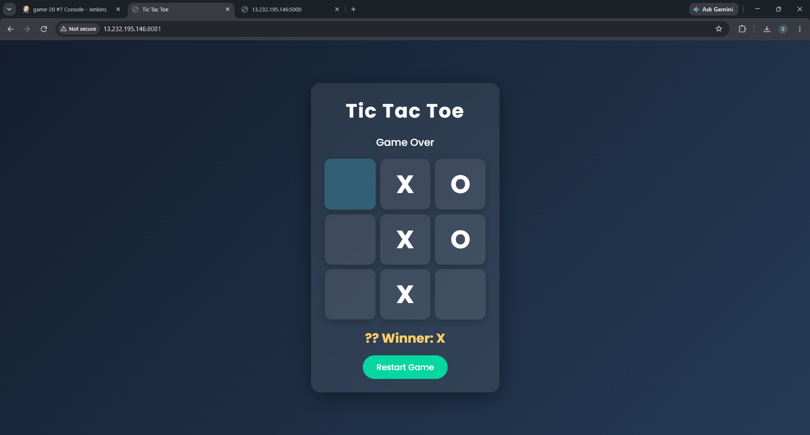
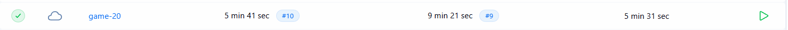
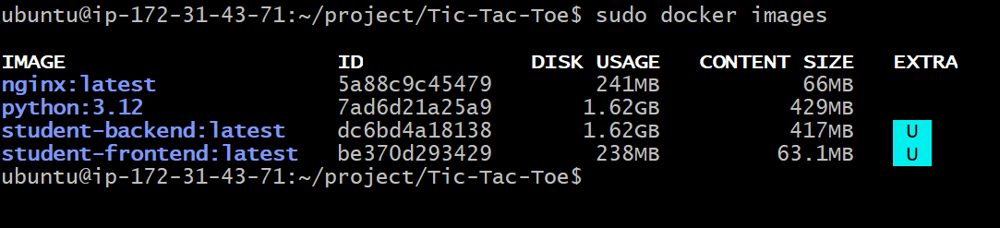

# 🎮 Tic Tac Toe - CI/CD Pipeline with Jenkins, Docker & AWS EC2

## 📌 Project Overview

This project demonstrates a complete Continuous Integration and Continuous Deployment (CI/CD) pipeline for a Tic Tac Toe web application using Jenkins, Docker, Docker Hub, and AWS EC2.

The application consists of:

- 🎨 Frontend (HTML, CSS, JavaScript)
- ⚙️ Backend (Flask REST API)

The application is containerized using Docker and automatically deployed to an AWS EC2 instance through a Jenkins pipeline whenever new changes are pushed to the GitHub repository.

---

# 🏗️ Architecture

```text
Developer
    │
    ▼
GitHub Repository
    │
    ▼
GitHub Webhook
    │
    ▼
Jenkins Pipeline
    │
    ├── Pull Latest Code
    ├── Build Docker Images
    ├── Push Images to Docker Hub
    └── Deploy Application on AWS EC2
            │
            ▼
       Docker Containers
            │
            ▼
          Browser
```

---

# 🚀 Technologies Used

- AWS EC2
- Jenkins
- Docker
- Docker Hub
- Git & GitHub
- GitHub Webhooks
- Python
- Flask
- HTML
- CSS
- JavaScript
- Linux (Ubuntu)

---

# ✨ Features

- Interactive Tic Tac Toe Game
- Flask REST API
- Dockerized Application
- Jenkins CI/CD Pipeline
- GitHub Webhook Integration
- Automated Docker Image Build
- Docker Hub Integration
- Automated Deployment on AWS EC2

---

# 📂 Project Structure

```text
tic-tac-toe/
│
├── backend/
│   ├── app.py
│   ├── requirements.txt
│   └── Dockerfile
│
├── frontend/
│   ├── index.html
│   ├── style.css
│   ├── script.js
│   └── Dockerfile
│
├── docker-compose.yml
├── Jenkinsfile
└── README.md
```

---

# 🔄 CI/CD Workflow

1. Developer pushes code to GitHub.
2. GitHub Webhook triggers the Jenkins pipeline.
3. Jenkins pulls the latest source code.
4. Docker images are built automatically.
5. Docker images are pushed to Docker Hub.
6. Jenkins deploys the latest application on the AWS EC2 instance.
7. Users can access the updated application through the browser.

---

# 📸 Screenshots

## Home Screen 



---

## Jenkins Pipeline



---

## Docker Containers


--- 
## Images 



---

## Running Docker Containers

```bash
docker ps
```

--- 

# ⚙️ Deployment Steps

Clone the repository

```bash
git clone https://github.com/your-username/tic-tac-toe.git
cd tic-tac-toe
```

Build Docker Images

```bash
docker build -t your-dockerhub/frontend ./frontend
docker build -t your-dockerhub/backend ./backend
```

Run Containers

```bash
docker-compose up -d
```

---

# 📚 Learning Outcomes

- Building CI/CD pipelines using Jenkins
- Docker image creation and management
- Docker Hub integration
- GitHub Webhook automation
- Deploying containerized applications on AWS EC2
- Continuous Integration and Continuous Deployment best practices

---

# 🔮 Future Improvements

- Deploy using Kubernetes
- Add HTTPS with Nginx Reverse Proxy
- Integrate Prometheus & Grafana
- Implement Blue-Green Deployment

---

# 👩‍💻 Author

**Samidha Nitin Wani**

Aspiring Cloud & DevOps Engineer

⭐ If you found this project useful, consider giving it a ⭐ on GitHub!
